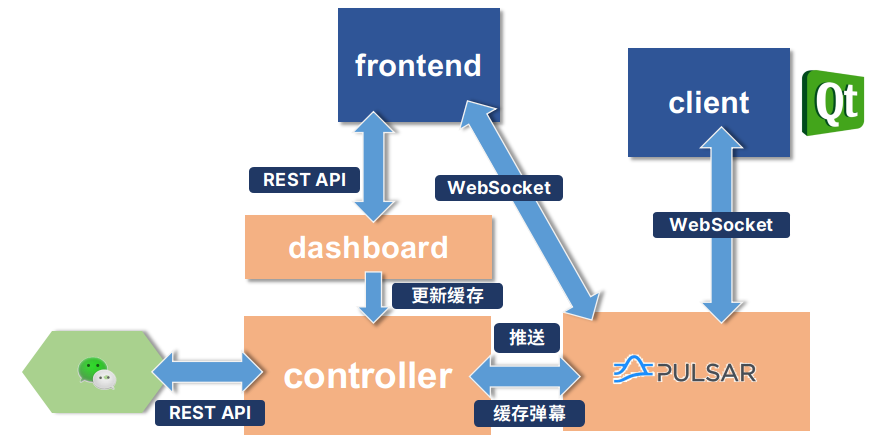

# 参与开发

弹幕一下是一个开源项目。在你使用的同时，我们非常欢迎你为产品添加新的功能。

如果你有这方面的打算，我们建议先在 issue 内和管理员进行讨论，再提交 Pull Request。我们会重视你提出的意见或建议。

## 开始开发

```shell
git clone --recursive https://github.com/panda2134/DanmakuIt.git
```

这将会下载弹幕一下的完整源代码。代码位于`src`目录，由以下部分组成：

- `frontend` 管理所用前端，负责增删房间、配置房间等功能，采用 [Nuxt.js 2](https://nuxtjs.org/) 编写；
- `dashboard` 管理前端对应的 REST API 接口，采用 [FastAPI](https://fastapi.tiangolo.com/) 实现；
- `controller` 负责微信弹幕发送请求和服务器内部与 Pulsar 通信相关请求，采用 [sanic](https://sanicframework.org/) 实现；
- `tagger` 负责对评论进行审核的 Pulsar Client；
- `client` 桌面客户端。

在开始开发前，你需要配置一下开发环境。我们推荐的配置为：

- Python 3.9.x
- Node.js 16.x, 并采用 `yarn` 包管理器
- Docker 与 `docker-compose`，或者 Podman 与 `podman-compose`
- Qt 6.2.2

下图展示了各个服务的交互流程。



## 接口设计

### 控制器

控制器提供了一系列的 REST API，用于和微信/其余服务交互。关于 API 详情，可见 [控制器API接口](./controller) 页面。
控制器可运行多个进程；多个进程间采用 Redis 进行消息同步。

### Pulsar

Pulsar 暴露的主要是基于 WebSocket 的消息推送接口，可以参考[接口文档](./pulsar)。

### 管理后端

管理后端采用 FastAPI 编写，并用 arq 进行异步后台任务的调度。FastAPI 自动生成的文档可见


