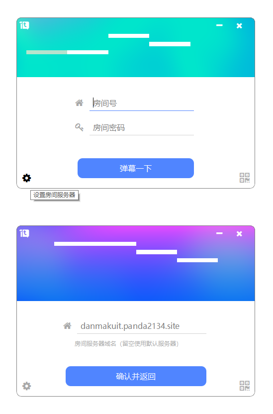
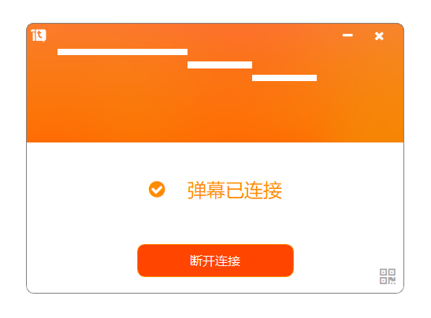
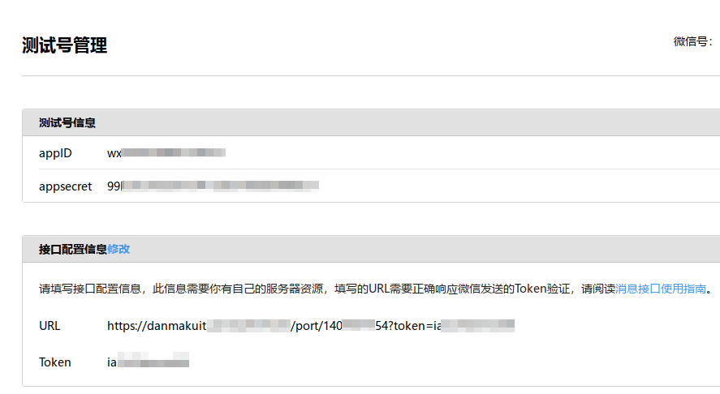
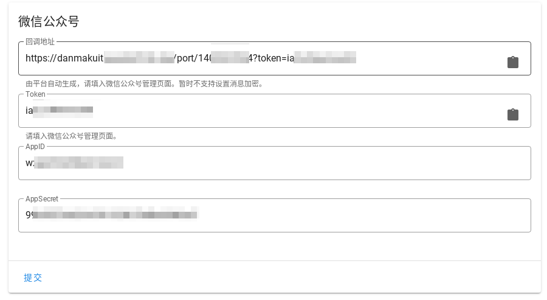
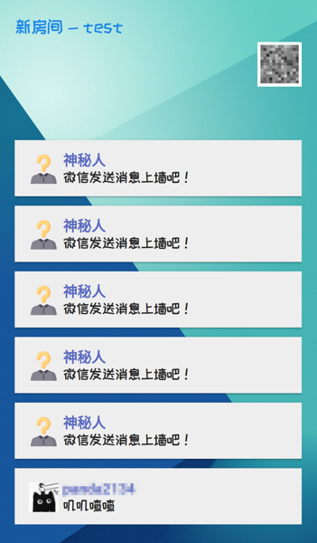

## 客户端

桌面客户端可在 [发布页面](https://github.com/MoebiusMeow/DanmaKuItDesktop/releases) 下载。

::: info
  目前桌面客户端只在 Windows 和 Arch Linux (KDE) 进行了测试，其中在 KDE 上有些小问题。
  因此，我们暂时只提供 Windows 版本的可执行文件。
:::

### 运行客户端

此时输入房间号和密码进行连接，将连接至默认房间服务器 `danmakuit.panda2134.site`.
点击左下角的齿轮形“设置”按钮，进入配置页面。

:::tip
`danmakuit.panda2134.site` 是我们的集成测试环境，目前暂时不对外开放；如有需求，可以自行部署。
:::

### 配置房间服务器

如上图，输入房间服务器域名。注意：不应包含 `http://`、`https://` 等协议前缀。

确认并返回之后，填写的服务器地址将自动保存，再次启动不需要重新配置。

### 连接房间

输入房间号和密码，以连接到房间；如果连接成功，将展示如下页面。

此时可以点击右上角的减号“-”按钮，将客户端最小化至系统托盘区，弹幕将继续正常显示。

## 服务端

服务端可在 [GitHub](https://github.com/panda2134/DanmakuIt) 获得。参考[新手指南](../guide/)以进行配置。

### 第一个弹幕房间

首先，在首页点击“注册登录”，并通过配置的任意一种验证方式进行登录。
创建房间后，在房间信息可以看到微信公众号的回调地址和 Token，请原封不动地粘贴到微信公众号平台的管理页面中。同时，把微信公众号平台的 AppID / AppSecret 填入房间信息页面，最后点击提交以保存。

在第一次填入这些信息后，应当抓取已有关注者信息，以避免头像 / 昵称显示出现问题。

### 连接设备

然后进入连接设备选项卡。在设备连接信息中，可以看到房间号和房间密码。
使用这些信息，在投屏客户端中连接房间。运行客户端，把房间号与密码填入其中，成功连接后新发送的弹幕即会投送到屏幕上。

点击弹幕墙链接打开滚动式的弹幕墙。在不方便安装客户端投屏的设备上，滚动式弹幕墙会很有用。建议按 F11 全屏使用。

### 弹幕审核

弹幕审核选项卡提供了审核相关的功能，可以发送管理员弹幕，也可以撤下人工发现的违规弹幕信息。
开启自动审核时，被云端标记为违规的弹幕不会显示；此外，匹配在房间信息页面指定关键词的弹幕也不会显示。
