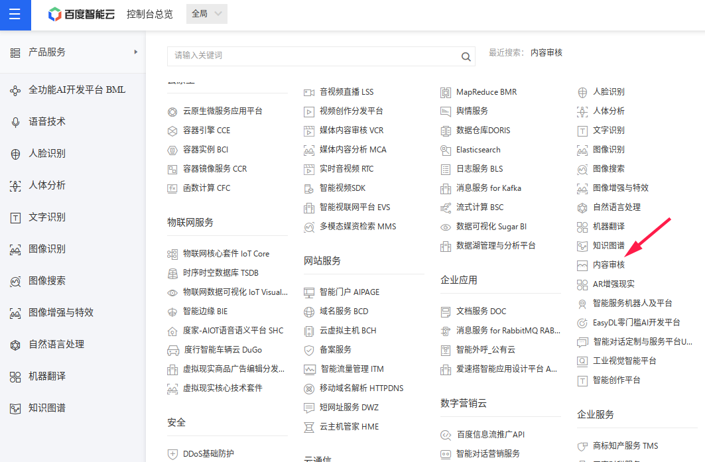
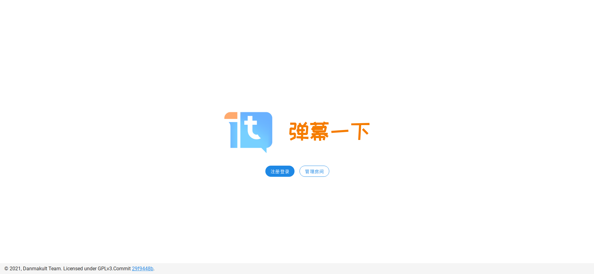

# 新手指南

<script setup>
import env from '../envfile.json'
import { ref, computed, onMounted } from 'vue'
import JSZip from 'jszip'
import arrayToHex from 'array-buffer-to-hex'

const envModel = ref(env)
const fileList = computed(() => Object.keys(envModel.value))

onMounted(() => {
    for (const [k, xs] of Object.entries(envModel.value)) {
        for (const v of xs) {
            if (v.type === 'rand') {
                const randArray = new Uint8Array(v.len / 2)  // v.len is count of hex digits, /2 to get byte count
                crypto.getRandomValues(randArray)
                v.value = arrayToHex(randArray)
            }
        }
    }
})

const createConfigZip = async () => {
    const zip = new JSZip()
    for (const [k, xs] of Object.entries(envModel.value)) {
        const result = ['# Generated with DanmakuIt Envfile Generator']
        for (const v of xs) {
            result.push(`${v.name}=${v.value}`)
        }
        zip.file(k, result.join('\n'))
    }
    const zipBlob = await zip.generateAsync({ type: 'blob' })
    const { saveAs } = await import('save-as')
    saveAs(zipBlob, 'envfile.zip')
}
</script>

<div style="display:flex;justify-content: center;">
    
</div>

弹幕一下是一款开源的弹幕投屏系统，其具有如下特点：

- 支持多种投屏方式，如屏上的滚动弹幕、弹幕墙等
- 通过接入微信公众号进行弹幕投屏，方便快捷
- 管理功能强大，除使用自动审核外，管理员可以手动审核弹幕

## 部署

### 准备工作

要部署弹幕一下，你需要如下的准备：

- 一台80，443端口对外可用的服务器，其需有 HTTPS 证书；
    - 如果你不知道如何申请证书，可以参考 [这里](https://caddyserver.com/docs/automatic-https)；后文也会详细介绍
- 一个域名，解析到上述服务器，用于申请 HTTPS 证书
- 用来上传小程序的微信公众平台账号，需 [自行注册](https://mp.weixin.qq.com/wxopen/waregister?action=step1)，并在小程序管理页面 开发 - 开发管理 - 开发设置 - 开发者ID 获取 AppId 和 AppSecret，记录备用。
- （可选）一个微信公众号，用于接入弹幕一下；测试阶段，可以采用微信接口测试号
    - 测试号可在 [这里](https://mp.weixin.qq.com/debug/cgi-bin/sandbox?t=sandbox/login) 申请

::: tip
之前，弹幕一下是通过接入微信公众号进行弹幕发送的；但是鉴于微信[接口调整限制](https://developers.weixin.qq.com/community/develop/doc/00028edbe3c58081e7cc834705b801?blockType=1)，该方法发送的弹幕不再包含用户的昵称和头像，从而无法在弹幕投屏显示。

因此，我们紧急上线了[微信小程序](https://github.com/panda2134/DanmakuIt-mp)，用于在发送弹幕时获取用户个人信息。
如果您自行部署弹幕一下平台，需要同时部署对应的小程序，方法见下。
:::

在下文中，我们假设服务器上运行 Ubuntu 20.04.

### 安装所需软件

首先，在服务器上安装 `git`, `docker` 和 `docker-compose`。注意 sudo 可能需要输入密码。

```shell
sudo apt-get update
# 安装 git
sudo apt-get install -y git
# 安装 docker
sudo apt-get install -y \
    apt-transport-https \
    ca-certificates \
    curl \
    gnupg \
curl -fsSL https://download.docker.com/linux/ubuntu/gpg | sudo gpg --dearmor -o /usr/share/keyrings/docker-archive-keyring.gpg
echo \
  "deb [arch=$(dpkg --print-architecture) signed-by=/usr/share/keyrings/docker-archive-keyring.gpg] https://download.docker.com/linux/ubuntu \
  $(lsb_release -cs) stable" | sudo tee /etc/apt/sources.list.d/docker.list > /dev/null
sudo apt-get update
sudo apt-get install -y docker-ce docker-ce-cli containerd.io
sudo docker run hello-world  # 测试是否安装成功

# 安装 docker-compose
sudo curl -L "https://github.com/docker/compose/releases/download/1.29.2/docker-compose-$(uname -s)-$(uname -m)" -o /usr/local/bin/docker-compose
sudo chmod +x /usr/local/bin/docker-compose
sudo ln -s /usr/local/bin/docker-compose /usr/bin/docker-compose
docker-compose --version  # 出现版本，则安装成功
```

### 安装 caddy

Caddy 是一个以 Go 编写的开源 HTTP 服务器，支持 HTTP/2 和自动 HTTPS。
我们推荐使用 Caddy 进行 HTTPS 流量的反向代理，因为其配置较为简易。

首先安装 Caddy:

```shell
sudo apt install -y debian-keyring debian-archive-keyring apt-transport-https
curl -1sLf 'https://dl.cloudsmith.io/public/caddy/stable/gpg.key' | sudo tee /etc/apt/trusted.gpg.d/caddy-stable.asc
curl -1sLf 'https://dl.cloudsmith.io/public/caddy/stable/debian.deb.txt' | sudo tee /etc/apt/sources.list.d/caddy-stable.list
sudo apt update
sudo apt install caddy
```

假设你服务器的 IP 地址为 `12.34.56.78`，域名为 `danmakuit.example.com`，你需要首先配置域名解析到服务器的 IP 地址（使用 A 记录或 AAAA 记录）。
待确认解析正常后，向 `/etc/caddy/Caddyfile` 写入如下内容：

```caddyfile{2-4}
danmakuit.example.com {  # **注意**：改为你自己的域名！！
    tls mail@example.com #          改为你自己的邮箱，用于申请 Let's Encrypt 证书。
    respond "Hello, world!"   ## <- 用来测试，之后需要改为反向代理
    encode gzip
}
```

::: warning
在自己服务器上部署时，务必把域名和邮箱改为自己的，否则会导致证书申请失败。
:::

然后，重新加载 Caddy：

```shell
sudo systemctl reload caddy
```

在浏览器中访问你自己的域名，应该可以看到 `Hello, world!`，且地址栏显示为安全的 HTTPS 连接。

### 配置自动审核

目前，我们使用百度提供的文本远程审核接口，其免费额度足以普通用户使用；在关闭自动审核时，默认拒绝投屏所有的文本。

::: info
在未来版本，我们会支持更加宽松的审核策略，如在关闭自动时采用黑名单策略，即对不匹配关键词的弹幕直接予以通过。
:::

首先，按照百度智能云的[文档](https://ai.baidu.com/ai-doc/REFERENCE/Ck3dwjgn3)，
在进入内容审核产品页面后，创建一个内容审核应用程序，并且获得其对应 API Key 和 Secret Key。记录这两个 Key 用于之后的设置。



### 配置 OAuth

目前支持 GitHub 和 GitLab 的 OAuth 作为管理平台登录方式。

#### GitHub

点击右上角头像，在 Settings 页面左侧找到 Developer settings，点击 OAuth Apps > New OAuth App 以创建一个新的 Application，设置为：

- Application Name: 任意
- Homepage URL: 网站域名
- Authorization callback URL: `https://你的网站域名/api/v1/user/social-login/github/auth`

然后保存应用程序，并记录 Application ID 和 Secret.

#### GitLab (官方/自托管)

点击右上角头像，在 Edit Profile 页面左侧找到 Applications 以创建一个新的 Application，设置为：

- Name: 任意
- Redirect URI: 
  - 对官方 GitLab，为 `https://你的网站域名/api/v1/user/social-login/gitlab/auth`
  - 对自托管 GitLab，为 `https://你的网站域名/api/v1/user/social-login/gitlab3rd/auth`
- Confidential: 勾选
- Scopes: 勾选 read_user

然后保存应用程序，并记录 Application ID 和 Secret.

### 下载和配置弹幕一下

运行以下命令：

```shell
git clone https://github.com/panda2134/DanmakuIt.git
```

然后需要生成配置文件。
由于配置文件较多，这里提供了一个用于生成密码文件的工具。其中，已有值的项为自动生成。
填写好表格后，点击“下载配置”并解压压缩包，以压缩包内 `*.env` 文件覆盖repo中同名文件内容即可。

::: tip 配置生成工具
<form action="" v-for="filename in fileList" style="margin: 1rem 0;">
    <h4 style="margin-bottom: 0.5rem;">{{ filename }}</h4>
    <div v-for="x in envModel[filename]" style="display: flex; margin-bottom: 0.3rem;">
        <label :for="x.name" style="margin-right: 0.5rem; flex-grow: 0;">{{x.field}}</label>
        <input v-model="x.value" :name="x.name" style="flex-grow: 1;">
    </div>
</form>
<button @click="createConfigZip" style="margin-bottom: 1em">下载配置</button>
:::

:::warning
不建议在第一次运行前禁用新用户注册，否则将无法注册第一个账户；建议待所有人注册完成后，在 `site.env` 中禁用，再运行
```shell
docker-compose down
docker-compose up -d
```
以重启服务。
:::

上传配置后，设置 `/etc/caddy/Caddyfile`，**修改** 为：

```caddyfile{3}
danmakuit.example.com {  # **注意**：改为你自己的域名！！
    tls mail@example.com #          改为你自己的邮箱，用于申请 Let's Encrypt 证书。
    reverse_proxy localhost:8000   ## 反向代理
    encode gzip
}
```

:::warning
正式运行弹幕一下前，需要如上正确配置反向代理，否则将无法从外部以HTTPS访问。
:::

然后正式运行：

```shell
cd DanmakuIt  # 切换到源代码所在目录
docker-compose up -d --build
```

等待数分钟后访问你的服务器域名，应该可以看到服务器已经上线。



完成了部署后，你可以尝试[创建第一个房间](../documentation/)。Enjoy it!

### 部署小程序

为了实现发送弹幕时获取用户个人信息的功能，需要自行部署发弹幕小程序。

#### 小程序端设置

首先，完成小程序的 [注册](https://mp.weixin.qq.com/wxopen/waregister?action=step1)，并完善其基本信息。
此外，需要在 开发 - 开发管理 - 开发设置 - 服务器域名 处，把 `request合法域名` 设为你的部署域名（含 `https`），如  `https://danmakuit.example.com`。

然后，从下列源码仓库获得小程序代码：[https://github.com/panda2134/DanmakuIt-mp](https://github.com/panda2134/DanmakuIt-mp)，下载源码解压后，进行以下修改：

- `project.config.json`: 修改 `"appid"` 字段的值为你的小程序 AppId
- `miniprogram/utils/util.ts`: 修改 `BASE_URL` 的值为你的部署域名（含 `https` ），如 `https://danmakuit.example.com`


最后采用 [微信开发者工具](https://developers.weixin.qq.com/miniprogram/dev/devtools/devtools.html) 打开项目文件夹，上传并提交审核。

:::info
小程序提交审核上线时，服务端应当处于开启状态。
:::

#### 服务端设置

服务端需要配置小程序 AppId / AppSecret，你应当在使用 [配置生成工具](#下载和配置弹幕一下) 时已经填入了它们。如果没有，请自行填入后重启服务器。

服务器配置微信小程序环境版本用于小程序码的生成。默认生成的是 `release` 版本小程序码；如果小程序尚未发布，可以在通过微信开发者工具发布体验版后，将此字段设为 `trial`。具体可用取值可以参考 [对应微信API](https://developers.weixin.qq.com/miniprogram/dev/api-backend/open-api/qr-code/wxacode.getUnlimited.html#%E8%AF%B7%E6%B1%82%E5%8F%82%E6%95%B0) 的 `env_version` 参数。

## 进一步了解
### 遇到问题？

可以在[issue](https://github.com/panda2134/DanmakuIt/issues)中提出，开发团队会尽快回复。但是，请保证你在提问前包含了以下信息：

- 具体出现问题的步骤，以及该步骤的详细日志
    - 如采用 `docker-compose logs` 获得弹幕一下的日志
- 部署所用的操作系统环境
- 采用的“弹幕一下”软件版本

:::warning
采用 Caddy 签发的 Let's Encrypt 证书在旧设备不受信任，这是一个[已知问题](https://letsencrypt.org/docs/dst-root-ca-x3-expiration-september-2021/)。具体表现为，在这些设备上，客户端连接时提示“错误代码6: SSL handshake failed”.
更新这些设备的操作系统可以解决问题。
:::

### 参与开发

弹幕一下是由四名普通大学生开发的产品，由于我们水平有限，势必会有这样或者那样的问题。
这是一款自由软件，你也能为代码做出贡献。

要参与开发，请参考[开发文档](../development/index.md)。若你有兴趣加入项目维护，请发邮件给 me # panda2134 . site （请把 # 换成 at）.